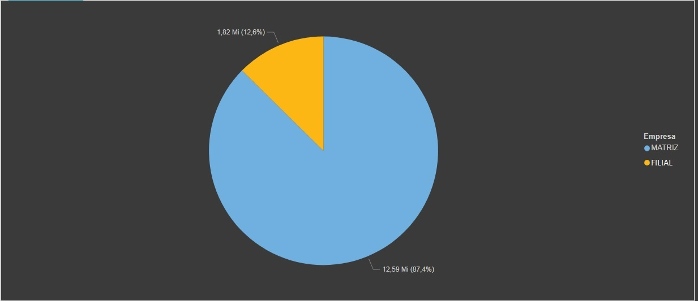

# Analise Faturamento Oficina
Microsoft SQL Server, Microsoft Power BI Desktop

Neste artigo teremos como analise o setor de serviços de uma concessionária de veículos.
Foi solicitado pela direção da empresa um dashboard para avaliar as vendas do setor de oficina para entender como está seu faturamento e penetração no mercado a nível Brasil.

Para executar esta atividades realizou se uma entrevista com gestor da área para entender melhor a sua percpção de quais dados seriam necessários para mensurar as informações.
Foram solicitados os seguintes itens para demonstrar no dashboard:
* Total de venda por ano
* Analisar vendas por Produto e Serviços
* Faturamento por tipo de Ordem de Serviço
* % participação por Matriz e Filial
* Área de atuação

Conforme solicitação foi criado o DashBoard "Análise de Vendas Oficina"

