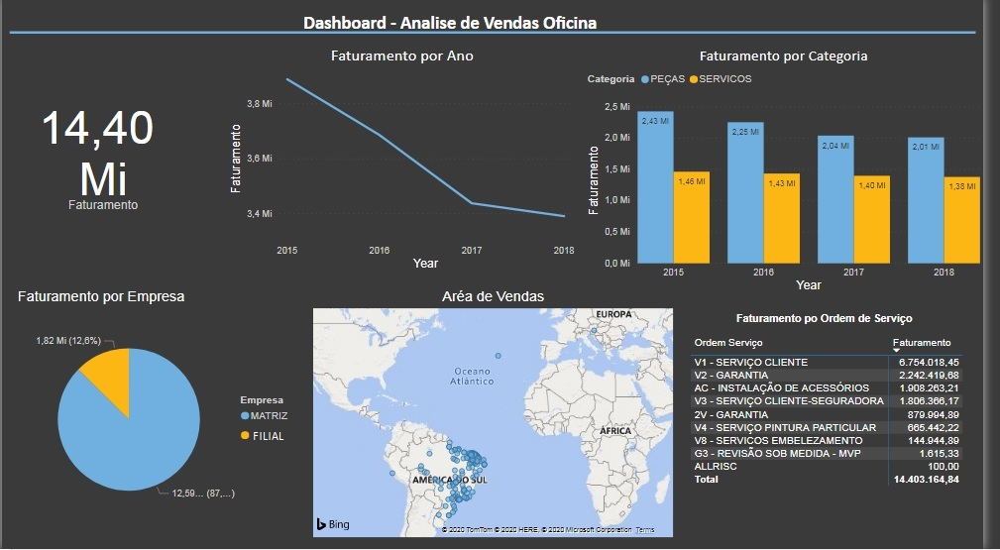
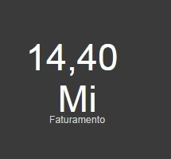
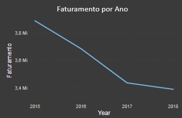

# Analise Faturamento Oficina
Microsoft SQL Server, Microsoft Power BI Desktop

Neste artigo teremos como analise o setor de serviços de uma concessionária de veículos.
Foi solicitado pela direção da empresa um dashboard para avaliar as vendas do setor de oficina para entender como está seu faturamento e penetração no mercado a nível Brasil.

Para executar esta atividades realizou se uma entrevista com gestor da área para entender melhor a sua percpção de quais dados seriam necessários para mensurar as informações.
Foram solicitados os seguintes itens para demonstrar no dashboard:
* Total de venda por ano
* Analisar vendas por Produto e Serviços
* Faturamento por tipo de Ordem de Serviço
* % participação por Matriz e Filial
* Área de atuação

Conforme solicitação foi criado o DashBoard "Análise de Vendas Oficina", o qual tem um resumo de todas as informações solicitadas. Neste Dashboard, podemos observar todos itens em uma única página. 

O Gestor poderá analisar todos os itens e fazer comparações e entender como anda seu faturamento.

Vamos agora apresentar cada item separadamento e explanar sobre os insights retomados.

##Faturamento Geral

Neste gráfico retornamos a informação de todo faturamento da empresa durante o periode de 2015 à 2018.

## Faturamento por Ano

Realiza a exposição do Faturamento da empresa durante uma linha temporal(anos), no qual podemos observar o declínio dos faturamento no decorre dos anos apresntados. Pode se observar que a empresa está perdendo vendas, ou relação com mercado que encolheu, essa informação por si somente não pode demonstrar o que ocorre dentro da empresa, por isso montamos próximo gráfico que demonstra um pouco mais sobre essa baixa do faturamento.
